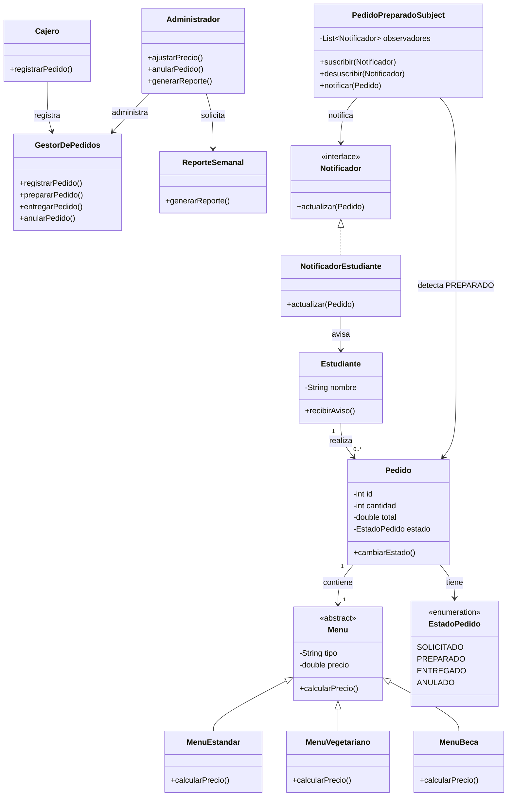

Franclin Aguilar Cayo

//Cómo llegué al diagrama

1. Sustantivos

De los requerimientos salen principalmente:

* Estudiante
* Pedido
* Menú
* Cajero
* Administrador
* Reporte
* Aviso
* Comedor

También aparece el estado del pedido porque el pedido pasa por:

`SOLICITADO → PREPARADO → ENTREGADO / ANULADO`

2. Verbos

Las acciones principales son:

* pedir
* registrar
* preparar
* entregar
* anular
* ajustar precios
* avisar
* generar reporte

3. Filtro

No todos los sustantivos tienen que convertirse en una clase.

Me quedé con las clases que tienen información o comportamiento propio dentro del sistema.

Por eso aparecen `Estudiante`, `Pedido`, `Menu`, `GestorDePedidos`, `Cajero`, `Administrador`, `ReporteSemanal` y las clases relacionadas con la notificación.

4. Relaciones

Un estudiante puede realizar varios pedidos y cada pedido tiene un menú.

El pedido tiene un estado que va cambiando durante el proceso.

El cajero se encarga de registrar pedidos y el administrador puede ajustar precios, anular pedidos y solicitar el reporte semanal.

Para el requerimiento de avisar cuando el pedido queda preparado se agrega el diseño de Observer, representado por `PedidoPreparadoSubject` y `Notificador`.

El patrón también queda incluido en este diagrama para mantener coherencia con la parte 3.
