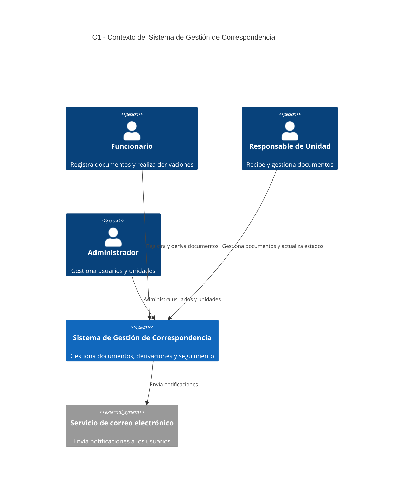
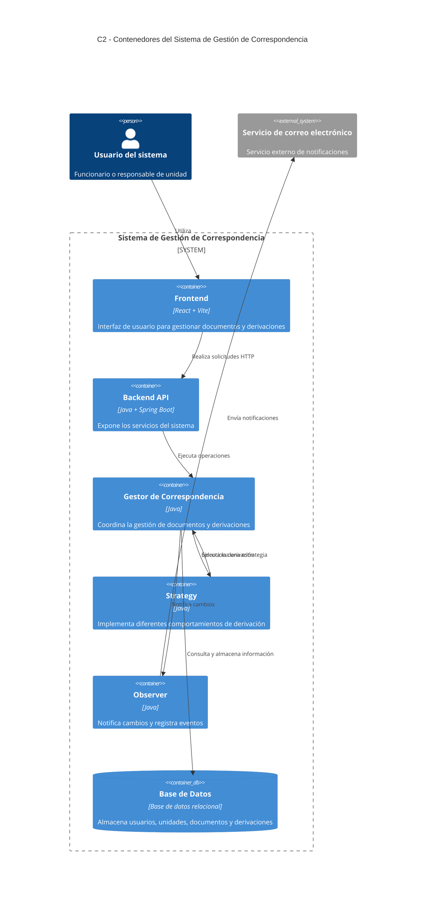

# H4 - Decisión final de arquitectura

## Sistema de Gestión de Correspondencia

**Proyecto:** Sistema de Gestión de Correspondencia  
**Laboratorio:** H4 - Patrones de Diseño  
**Patrones seleccionados para la fusión:** Strategy + Observer  
**Implementación final:** `h3/final/`

---

# 1. Introducción

El Sistema de Gestión de Correspondencia permite registrar documentos, gestionar derivaciones entre funcionarios y unidades, realizar seguimiento de los documentos y comunicar los cambios producidos durante su procesamiento.

Durante el laboratorio H3 se analizaron e implementaron diferentes patrones de diseño:

- Factory
- Builder
- Adapter
- Singleton
- Observer
- Strategy
- Decorator

Después de analizar las necesidades del sistema, se seleccionaron los patrones **Strategy** y **Observer** para realizar la integración final.

La implementación de cada patrón por separado se encuentra en las carpetas correspondientes dentro de `h3/`.

La integración de los dos patrones seleccionados se encuentra en:

```text
h3/final/
```

La documentación de la decisión arquitectónica se encuentra en:

```text
h4/
```

---

# 2. Objetivo de la fusión

El objetivo de la implementación final es integrar dos patrones que respondan a necesidades concretas del Sistema de Gestión de Correspondencia.

Los patrones seleccionados son:

- **Strategy:** para manejar diferentes tipos de derivación.
- **Observer:** para notificar los cambios producidos durante la gestión de documentos y derivaciones.

La combinación de ambos permite separar la lógica que determina cómo se realiza una derivación de las acciones que deben ejecutarse cuando ocurre un cambio.

---

# 3. Patrón Strategy

## 3.1. Problema que resuelve

El sistema puede realizar diferentes tipos de derivaciones.

Por ejemplo:

- Derivación ordinaria.
- Derivación urgente.

Si todos los comportamientos fueran implementados dentro de una única clase mediante múltiples condicionales, el código podría aumentar su complejidad y dificultar la incorporación de nuevos tipos de derivación.

Strategy permite encapsular cada comportamiento en una estrategia independiente.

---

## 3.2. Aplicación en el sistema

En la implementación final se utiliza una interfaz común:

```text
EstrategiaDerivacion
```

Las estrategias concretas implementan dicho comportamiento:

```text
DerivacionOrdinaria
DerivacionUrgente
```

El componente encargado de gestionar la operación selecciona la estrategia correspondiente y ejecuta la derivación.

---

## 3.3. Participantes

### EstrategiaDerivacion

Define el contrato que deben cumplir las diferentes estrategias de derivación.

### DerivacionOrdinaria

Implementa el comportamiento correspondiente a una derivación ordinaria.

### DerivacionUrgente

Implementa el comportamiento correspondiente a una derivación urgente.

### GestorCorrespondencia

Utiliza la estrategia seleccionada y coordina el proceso de derivación.

---

# 4. Patrón Observer

## 4.1. Problema que resuelve

Cuando ocurre una operación sobre un documento o derivación, pueden existir diferentes componentes interesados en conocer el cambio.

Por ejemplo:

- El sistema de notificaciones.
- El sistema de auditoría.

No sería conveniente que el gestor de correspondencia tuviera que conocer directamente toda la lógica de cada una de estas acciones.

Observer permite notificar a diferentes objetos cuando ocurre un evento.

---

## 4.2. Aplicación en el sistema

El gestor de correspondencia mantiene observadores registrados.

Cuando ocurre una operación importante, se notifica a los observadores.

En la implementación final se consideran:

```text
Observador
NotificadorEmail
AuditoriaObserver
```

---

## 4.3. Participantes

### Observador

Define el contrato que deben implementar los objetos que reciben las notificaciones.

### NotificadorEmail

Recibe la notificación de un cambio y representa el envío de una notificación al usuario correspondiente.

### AuditoriaObserver

Recibe la notificación y registra la operación realizada.

### GestorCorrespondencia

Es el componente que genera el evento y notifica a los observadores registrados.

---

# 5. Fusión de Strategy + Observer

La implementación final integra ambos patrones dentro del proceso de gestión de derivaciones.

Strategy y Observer cumplen responsabilidades diferentes.

Strategy determina **cómo se ejecuta la derivación**.

Observer determina **qué componentes reaccionan cuando ocurre un cambio**.

---

## 5.1. Flujo de funcionamiento

El proceso general es:

```text
Usuario solicita una derivación
              |
              v
    GestorCorrespondencia
              |
              v
      Selecciona Strategy
              |
       +------+------+
       |             |
       v             v
  Ordinaria       Urgente
       |             |
       +------+------+
              |
              v
       Ejecuta derivación
              |
              v
       Se produce cambio
              |
              v
        Notifica Observer
              |
       +------+------+
       |             |
       v             v
 Notificador      Auditoria
   Email           Observer
```

---

## 5.2. Ejemplo

Supongamos que un funcionario realiza una derivación urgente.

El flujo sería:

1. El usuario solicita una derivación.
2. `GestorCorrespondencia` recibe la solicitud.
3. Se selecciona `DerivacionUrgente`.
4. `DerivacionUrgente` ejecuta el comportamiento correspondiente.
5. La operación genera un cambio en la derivación.
6. `GestorCorrespondencia` notifica a los observadores.
7. `NotificadorEmail` procesa la notificación.
8. `AuditoriaObserver` registra la operación.

De esta forma, la estrategia se ocupa de la derivación y los observadores reaccionan al resultado de la operación.

---

# 6. Implementación final

La implementación integrada se encuentra en:

```text
h3/final/
```

La estructura principal es:

```text
h3/final/
├── EstrategiaDerivacion.java
├── DerivacionOrdinaria.java
├── DerivacionUrgente.java
├── Observador.java
├── NotificadorEmail.java
├── AuditoriaObserver.java
└── GestorCorrespondencia.java
```

La relación entre las clases es:

```text
                 GestorCorrespondencia
                    /           \
                   /             \
                  v               v
       EstrategiaDerivacion    Observador
              /    \             /    \
             /      \           /      \
            v        v         v        v
     Derivacion   Derivacion  Email   Auditoria
     Ordinaria     Urgente
```

---

# 7. PARTE B - Documentación de la decisión

La Parte B de H4 documenta la decisión final mediante:

1. C1 - Diagrama C4 Nivel 1: Contexto.
2. C2 - Diagrama C4 Nivel 2: Contenedores.
3. ADR-001: Registro de la decisión arquitectónica.

---

# 8. C1 - Diagrama C4 Nivel 1: Contexto

El diagrama C4 de Nivel 1 representa el sistema como una caja y muestra los actores y sistemas externos que interactúan con él.

Los actores considerados son:

- Funcionario.
- Responsable de Unidad.
- Administrador.

Como sistema externo se considera el servicio de correo electrónico utilizado para las notificaciones.



---

# 9. C2 - Diagrama C4 Nivel 2: Contenedores

El diagrama C4 de Nivel 2 representa los principales contenedores del sistema.

Los contenedores relacionados directamente con la integración son:

- Backend API.
- Gestor de Correspondencia.
- Módulo Strategy.
- Módulo Observer.

Strategy se encuentra dentro del backend y se utiliza para seleccionar el comportamiento de la derivación.

Observer se encuentra dentro del backend y se utiliza para comunicar los cambios a los componentes interesados.



---

# 10. Ubicación de los patrones en C2

## Strategy

Strategy vive en el backend del sistema y participa directamente en la gestión de derivaciones.

Su responsabilidad es permitir que el gestor seleccione diferentes comportamientos sin concentrarlos en una única clase.

```text
Backend
   |
   └── GestorCorrespondencia
            |
            └── Strategy
                  ├── DerivacionOrdinaria
                  └── DerivacionUrgente
```

## Observer

Observer también forma parte del backend.

Su responsabilidad es reaccionar a los cambios generados durante la operación.

```text
Backend
   |
   └── GestorCorrespondencia
            |
            └── Observer
                  ├── NotificadorEmail
                  └── AuditoriaObserver
```

---

# 11. Relación entre C1, C2 y la implementación

El C1 representa la visión general del sistema y sus relaciones con los actores y sistemas externos.

El C2 muestra cómo se organiza internamente el sistema mediante contenedores.

La implementación de Strategy y Observer se encuentra dentro del backend, específicamente relacionada con el proceso de gestión de derivaciones.

La documentación permite relacionar los diferentes niveles:

```text
C1
Sistema de Gestión de Correspondencia
            |
            v
C2
Backend
            |
            +---- GestorCorrespondencia
            |
            +---- Strategy
            |
            +---- Observer
            |
            +---- Base de Datos
```

---

# 12. Comparación de responsabilidades

| Elemento | Responsabilidad |
|---|---|
| GestorCorrespondencia | Coordinar el proceso |
| Strategy | Seleccionar el comportamiento de derivación |
| DerivacionOrdinaria | Ejecutar una derivación ordinaria |
| DerivacionUrgente | Ejecutar una derivación urgente |
| Observer | Definir la recepción de eventos |
| NotificadorEmail | Procesar notificaciones |
| AuditoriaObserver | Registrar eventos |
| Base de Datos | Persistir información |

---

# 13. Beneficios de la fusión

La integración de Strategy y Observer proporciona:

- Separación de responsabilidades.
- Menor acoplamiento.
- Mayor facilidad para incorporar nuevos tipos de derivación.
- Mayor facilidad para incorporar nuevos observadores.
- Posibilidad de agregar nuevas notificaciones.
- Posibilidad de agregar auditoría sin modificar la estrategia.
- Mayor facilidad para realizar pruebas.
- Mejor organización del código.
- Mayor extensibilidad del sistema.

---

# 14. Costos de la fusión

La utilización de patrones también genera algunos costos.

Entre ellos:

- Mayor cantidad de clases e interfaces.
- Mayor complejidad inicial.
- Necesidad de comprender las relaciones entre los componentes.
- Necesidad de administrar correctamente las estrategias.
- Necesidad de administrar correctamente los observadores.
- Necesidad de realizar pruebas adicionales.

Estos costos se consideran aceptables debido a la separación de responsabilidades obtenida.

---

# 15. Relación con los demás patrones del H3

Durante H3 se implementaron diferentes patrones.

Sin embargo, la integración final solamente utiliza dos patrones.

Los patrones no seleccionados no se eliminan del laboratorio.

Se mantienen sus implementaciones individuales para demostrar el análisis realizado durante H3.

La fusión final utiliza:

```text
Strategy + Observer
```

porque ambos responden directamente al flujo de derivaciones y seguimiento del sistema.

---

# 16. Conclusión

La decisión final del laboratorio consiste en integrar los patrones Strategy y Observer en el módulo de gestión de derivaciones del Sistema de Gestión de Correspondencia.

Strategy permite encapsular diferentes comportamientos de derivación y seleccionar el comportamiento necesario.

Observer permite notificar los cambios generados durante el proceso a diferentes componentes, como el sistema de notificaciones y el registro de auditoría.

La combinación de ambos patrones permite mantener separadas las responsabilidades y facilita futuras extensiones del sistema.

La implementación final se encuentra en:

```text
h3/final/
```

La decisión arquitectónica se registra en:

```text
h4/adr-001.md
```